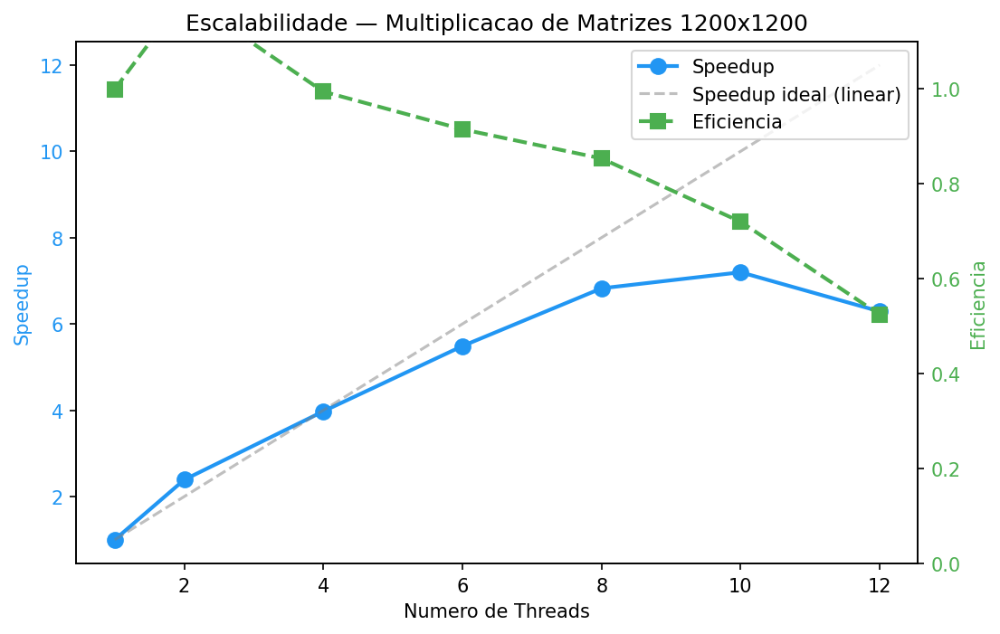

# P1 — Multiplicacao de Matrizes Grandes (mapa por linhas)

**Nome:** Victória Oliveira Estrela
**Matricula:** 20240008163
**Problema escolhido:** P1 — Multiplicacao de matrizes grandes · padrao: mapa por linhas (sem merge)

## Descricao

Calcula C = A x B, com A, B e C de tamanho n x n em row-major.
Custo O(n^3), fortemente CPU-bound — caso ideal para observar speedup com paralelizacao.
A versao paralela distribui as linhas de C entre T threads, cada uma computando um bloco
contiguo de linhas. Como cada thread escreve em posicoes disjuntas, nao ha merge nem
estado compartilhado.

---

## Estrutura do projeto

```
├── CMakeLists.txt
├── Makefile
├── README.md
├── src/
│   ├── main.c
│   ├── matrix_multiply.c
│   └── matrix_multiply.h
├── tools/
│   └── plot.py
├── images/
│   └── speedup.png
└── benchmark_results.csv
```

---

## Como compilar e executar

### Via CMake (recomendado)

```bash
cmake -B build -DCMAKE_BUILD_TYPE=Release
cmake --build build
```

### Via Makefile

```bash
make
```

### Via comando gcc unico

```bash
gcc -O2 -Wall -Wextra -std=c11 -pthread src/main.c src/matrix_multiply.c -o matrix_multiply -lm
```

### Executar

```bash
./matrix_multiply <n> <num_threads> [num_runs]
```

**Parametros:**
- `n`: tamanho da matriz (n x n). Sugestao: 1000 a 1500.
- `num_threads`: numero de threads (parametrizavel). Use o numero de nucleos da maquina.
- `num_runs` (opcional): repeticoes cronometradas. Use >= 5 para media confiavel
  (um aquecimento extra e sempre executado antes, fora da contagem).

**Exemplos:**

```bash
# Apenas verificacao de corretude
./matrix_multiply 1200 4

# Benchmark: 5 medicoes (+ 1 aquecimento automatico)
./matrix_multiply 1200 4 5

# Variar numero de threads
./matrix_multiply 1200 1 5
./matrix_multiply 1200 2 5
./matrix_multiply 1200 8 5
```

### Sweep completo (Q4)

```bash
python3 tools/plot.py --n 1200 --runs 5 --threads 1,2,4,6,8,10,12
```

---

## Ambiente de teste

| Item               | Especificacao                                |
|--------------------|----------------------------------------------|
| Modelo da CPU      | 12th Gen Intel(R) Core(TM) i7-1255U          |
| Nucleos fisicos    | 10 (2 Performance + 8 Efficiency)            |
| Nucleos logicos    | 12 (P-cores com HyperThreading)              |
| Compilador         | gcc (Ubuntu 15.2.0-16ubuntu1) 15.2.0         |
| Flags de compilacao | -O2 -Wall -Wextra -std=c11 -pthread          |
| Sistema operacional | Linux 7.0.0-15-generic (Ubuntu) x86_64       |

---

## Q2 — Baseline sequencial

A implementacao sequencial fornecida foi integrada em `src/matrix_multiply.c:multiply_seq()`.
As matrizes A e B sao preenchidas em codigo com valores deterministicos (srand com sementes fixas).
A cronometragem usa `clock_gettime(CLOCK_MONOTONIC)` isolando apenas a regiao de computacao
(alocacao e preenchimento ficam fora do cronometro).

O resultado e validado via checksum (soma de todos os elementos de C).

**T_seq** (media de 5 medicoes, apos aquecimento, n=1200): **4.3653 s**
(Matriz 1200x1200)

---

## Q3 — Versao concorrente com pthreads

A implementacao paralela esta em `src/matrix_multiply.c:multiply_par()`.
Cada thread recebe um `thread_arg_t` com os ponteiros para A, B, C, e o intervalo de
linhas `[start_row, end_row)`. As threads escrevem em posicoes disjuntas de C —
sem merge, sem estado compartilhado, sem corrida de dados.

O numero de threads e parametrizavel via argumento de linha de comando.

### Verificacao automatica

O programa compara `c_seq` com `c_par` elemento a elemento com tolerancia de `1e-6`.
Imprime `VERIFICACAO: OK` em caso de sucesso ou `VERIFICACAO: FALHA` com o elemento
divergente.

### Speedup (T = numero de nucleos logicos = 12)

| Threads | Tempo (s) | Speedup  |
|---------|-----------|----------|
| 1 (seq) |    4.3653 |   1.000x |
|      12 |    0.6940 |   6.290x |

---

## Q4 — Estudo de escalabilidade (extra)

### Varredura de threads

| Threads | Tempo (s) | Speedup  | Eficiencia |
|---------|-----------|----------|------------|
| 1 (seq) |    4.3653 |   1.000x |     1.0000 |
|       2 |    1.8273 |   2.389x |     1.1944 |
|       4 |    1.0981 |   3.975x |     0.9939 |
|       6 |    0.7955 |   5.487x |     0.9145 |
|       8 |    0.6396 |   6.825x |     0.8531 |
|      10 |    0.6065 |   7.197x |     0.7197 |
|      12 |    0.6940 |   6.290x |     0.5242 |

### Grafico Speedup x Numero de Threads



### Discussao

O speedup nao e linear por varios fatores. Primeiro, a **Lei de Amdahl** se aplica:
a criacao e juncao das threads (pthread_create/pthread_join) constitui uma parcela
sequencial que limita o speedup maximo, especialmente visivel ao passar de 10 para
12 threads onde o tempo piora (de 0.61s para 0.69s). Segundo, o **overhead de
criacao/destruicao de threads** se torna proporcionalmente maior conforme o trabalho
por thread diminui, reduzindo a eficiencia de 1.0 em T=1 para 0.52 em T=12.
Terceiro, ha efeito de **superlinearidade em T=2** (speedup 2.39x > 2.0 threads):
isso ocorre porque, com menos linhas por thread, o conjunto de trabalho cabe melhor
nos caches L2/L3 da CPU, reduzindo cache-misses — um fenomeno bem documentado em
cargas CPU-bound como multiplicacao de matrizes. Quarto, a **arquitetura hibrida**
do i7-1255U (2 P-cores + 8 E-cores) explica por que o pico de desempenho ocorre
em T=10: os P-cores tem maior frequencia e IPC, e apos T=10 o scheduler distribui
trabalho para nucleos de eficiencia mais lentos, piorando o balanceamento de carga
e reduzindo o speedup em T=12.

---

## Roteiro de Autoavaliacao

### Q1 — Repositorio, build e ambiente (1,0)

- [x] Repositorio Git com estrutura de diretorios organizada
- [x] CMake/Makefile funcional; compila com -O2 -Wall -Wextra, zero warnings, linka pthreads
- [x] README com nome, matricula, problema escolhido e instrucoes de build/execucao
- [x] README documenta o ambiente de teste (CPU, no de nucleos, compilador/flags, SO)

### Q2 — Baseline sequencial e medicao (1,0)

- [x] Implementacao sequencial fornecida integrada e executando
- [x] Resultado validado contra a ancora de corretude (checksum identico)
- [x] Cronometragem com relogio monotonico, isolando so a computacao
- [x] Media de >= 5 execucoes reportada (T_seq)

### Q3 — Versao concorrente (1,0)

- [x] pthreads com no de threads parametrizavel
- [x] Resultados parciais por thread + combinacao, sem corrida
- [x] Verificacao automatica: resultado paralelo == sequencial (OK/FALHA)
- [x] Speedup (T_seq / T_par) calculado e reportado no README

### Q4 — Escalabilidade (extra) (+1,0)

- [x] Varredura de no de threads (>= 4 pontos) com tabela de tempo/speedup/eficiencia
- [x] Grafico de speedup x no de threads
- [x] Discussao com >= 2 fatores (Amdahl, overhead, cache, arquitetura hibrida)

---

## Testes manuais (roteiro do PDF)

### Teste 1 — Compilacao limpa
```bash
$ make clean && make
# Esperado: zero erros, zero warnings com -Wall -Wextra
```

### Teste 2 — Corretude sequencial
```bash
$ ./matrix_multiply 1200 1
# VERIFICACAO: OK
# checksum sequencial = 43054401106.444855
```

### Teste 3 — Corretude paralela (varios T)
```bash
$ for t in 1 2 4 8 12; do ./matrix_multiply 1200 $t 1 | grep VERIFICACAO; done
# VERIFICACAO: OK em todos
```

### Teste 4 — Sanidade (T=1)
```bash
$ ./matrix_multiply 1200 1 5
# Speedup ≈ 1.0 (pequeno overhead de criacao de thread)
```

### Teste 5 — Estabilidade
```bash
$ ./matrix_multiply 1200 4 5
# Baixa variancia entre as repeticoes
```

### Teste 6 — Speedup esperado
```bash
$ ./matrix_multiply 1200 4 5
# Tempo cai claramente de T=1 para T=2/4 (speedup > 1)
```

### Teste 7 — ThreadSanitizer (opcional)
```bash
$ gcc -O1 -g -fsanitize=thread -pthread src/main.c src/matrix_multiply.c -o matrix_multiply_tsan -lm
$ ./matrix_multiply_tsan 200 4
# Nenhum warning de data race (entrada reduzida para nao ser muito lento)
```

---

## Convencoes

- Identificadores em **ingles** (snake_case)
- Comentarios em **portugues**
- Numero de threads **nunca "chumbado"** — sempre via argumento de linha de comando
